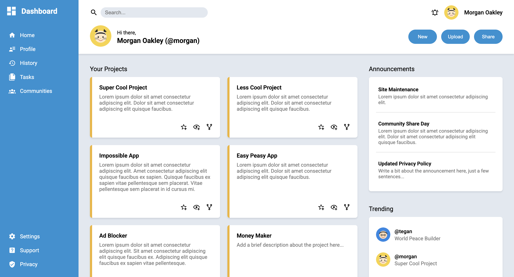
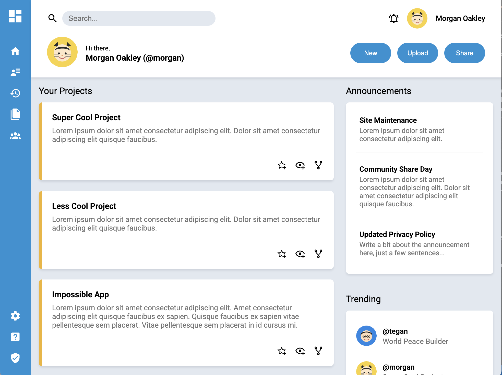
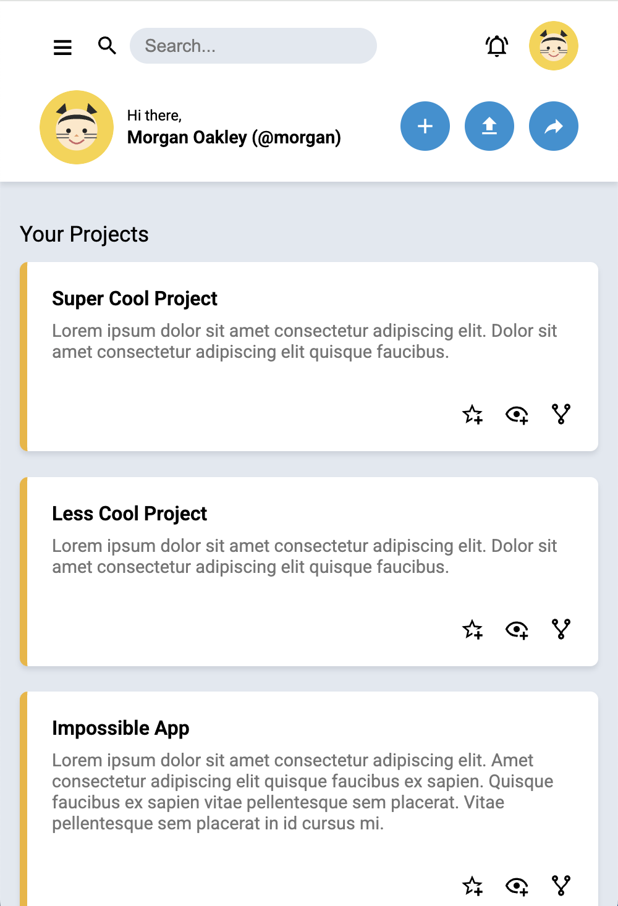

# Admin Dashboard

This project is part of [The Odin Project’s Intermediate HTML & CSS module](https://www.theodinproject.com/).  

The goal was to create a responsive **Admin Dashboard** layout using **Flexbox** and **CSS Grid**, focusing on practicing layout techniques without relying on frameworks.  

## About the Project
The Admin Dashboard is a static webpage that mimics the structure of a typical admin panel. It includes a **sidebar, header, and main content area** with widgets/cards. The primary aim was to practice **layout composition** rather than building full functionality.  

## Features
- Used **Flexbox** for alignment within components.  
- Used **CSS Grid** for page structure and card layout.  
- Implemented **responsive design** for different screen sizes.  
- Created **reusable components** such as sidebar navigation, header, and dashboard cards.  

## Preview
 

  
  
  

## What I Learned
- When to use **Flexbox vs Grid** for different UI components 
- How to **combine Flexbox and Grid** effectively to structure complex layouts.
- Creating **reusable UI components**.
- **Responsive design principles** without relying on frameworks.

## Future Improvements
- Improve mobile responsiveness
- Add a dark/light toggle switch

## Live Demo
[View the dashboard on GitHub Pages](https://ni-ki-web.github.io/admin-dashboard/)